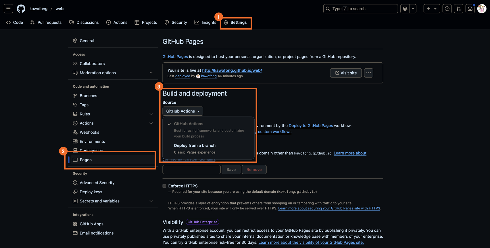

# kawofong.com

A personal website built using [Docusaurus](https://docusaurus.io/docs).

## Pre-requisites

- [pnpm](https://pnpm.io/installation)

## 🧑🏻‍💻 Local Development

1. Clone the repository and install dependencies:

    ```bash
    git clone https://github.com/kawofong/web.git
    cd web
    pnpm install
    ```

1. Make changes to the source files.

1. Run the web page in development mode to see changes:

    ```bash
    pnpm start
    ```

## Build

1. To create a production-optimized build, run:

    ```bash
    pnpm build
    ```

## Deploy

There are many hosting services available, and I recommend [GitHub Pages](https://pages.github.com/)
because it is easy to configure and free of charge. In addition, you can host your website using
a personalized url (e.g. `<username>.github.io`) or a
[custom domain](https://docs.github.com/en/pages/configuring-a-custom-domain-for-your-github-pages-site)

### Deploy to GitHub Pages

This repository has a [GitHub Action workflow](./.github/workflows/deploy.yml) configured to
deploy the Docusaurus site 🦖 to GitHub Pages.

1. Fork this [repository](https://github.com/kawofong/web)

    > If you want to use `<username>.github.io` as the url for your website, you would have to
    > name your new public repository `<username>.github.io`.
    > For more details, see https://pages.github.com/.

1. In your forked repository, configure GitHub Pages to build from GitHub Actions.

    

1. Follow instructions in the [local development][1] section (above) to make changes.

    > Remember to update the `baseUrl` value in [docusaurus.config.ts](./docusaurus.config.ts)
    > to match your url.

1. After you are done with your changes, commit and push your changes to the remote repository.

[1]: #-local-development
